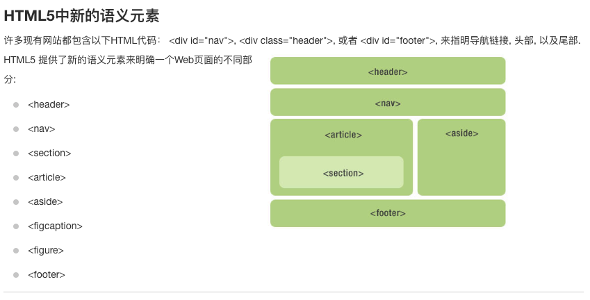

# 语义化

## 什么是语义化

语义化是指在 HTML 中使用一些特定的标签来搭建页面结构并传达相关标签所包含的内容类型的信息。

## 为什么需要语义化

- 结构更加清晰： 即使没有 css 也可以表达出清晰的结构
- 便于浏览器 SEO：爬虫通过标签来确定关键字的权重，因此可以获取到更多的有效信息，利于搜索引擎搜索
- 有些标签的属性可以提升用户体验
- 便于其他设备解析，例如无障碍网页等

### 常见的语义化标签

